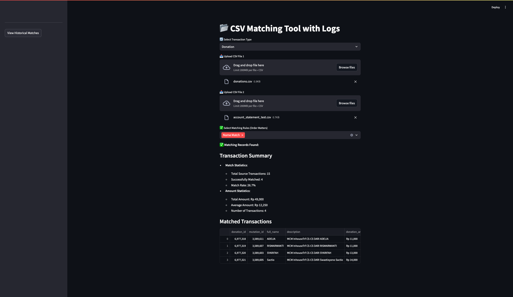

Personal experiment by using streamlit to map donation/topup transaction with account statement
Example of csv file is provided.

You can match by using 
- Name
- Amount
- Time creation (within a day)
- Permutation (so unique code can be permutated)

