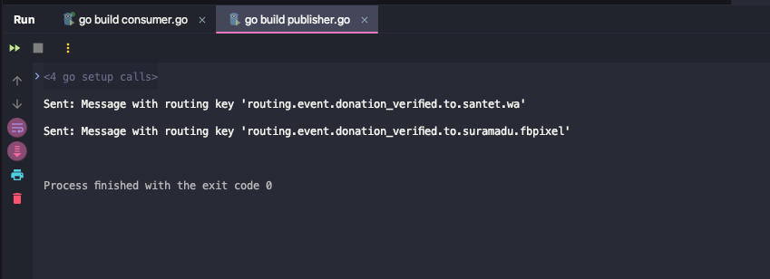
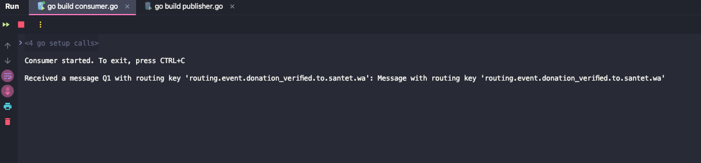

Showing example of how to use 1 queue with multiple routing
In this example, queue called `donation verified`
and there are multiple message with different routing published by rabbitmq publisher

Example is as below screenshot
## Publisher
  

## Consumer
  
