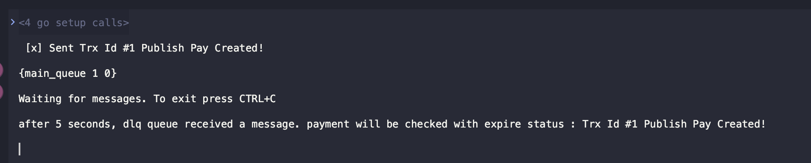

# Objective
This is an example to simulate how to use DLQ to process expired messages
- Setup main queue and dlq.
- Have consumer waiting in the dlq
- Make sure you have auto ack false and routing key for dlq consumer
- Publish a message with expiration time
- You can choose to have consumer on main queue consume it, nack it and not requeue 
- OR you dont have to consume it and just wait for the message to expire
- After expiration time, it will be rerouted to the DLQ

# Use Case
For example, you want to let simulate cron behaviour by letting same message circling around in the queue for some time.
- Cron requires you to select from DB. It is not efficient for some use cases to select a large load from the DB especially if you want to do it very often.
- This way, by having the message flowing from the dlq, we can consume the message and check the data. If it still not satisfied, we will publish it again to the main queue, then wait it to expire again, basically create a recursive flow. 
- This flow should have base cases for example it should only process until 2 hours. After 2 hours, if it is still not processed then it should be dropped (or do some business logic and ack it)

Real use case would be
- Create transaction into the DB and publish with expiration time 300.
```
err = ch.Publish(
		queueName, // exchange name
		"key",     // routing key
		false,
		false,
		amqp.Publishing{
			ContentType: "text/plain",
			Body:        []byte(body),
			Expiration:  "300", // assume expire time
		},
	)
```
- After 5 minutes, the transaction will be routed to the dlq
- Consumer DLQ will check `does this transaction has been paid by user?` from the 3rd party. If it is already paid, then it will update DB status to PAID

# Screenshot example
